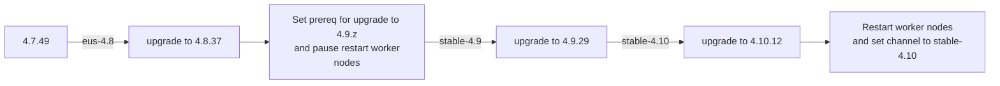

# Upgrade OpenShift from 4.7.x to 4.10.z
- [Upgrade OpenShift from 4.7.x to 4.10.z](#upgrade-openshift-from-47x-to-410z)
  - [Upgrade Path](#upgrade-path)
  - [Steps](#steps)

## Upgrade Path

Planning for upgrade with [Red Hat OpenShift Container Platform Update Graph](https://access.redhat.com/labs/ocpupgradegraph/update_channel)



## Steps
- Version
  ```bash
  oc get clusterversion
  ```
  Output

  ```bash
  NAME      VERSION   AVAILABLE   PROGRESSING   SINCE   STATUS
  version   4.7.49    True        False         41m     Cluster version is 4.7.49
  ```
- Set channel to eus-4.8
  
  ```bash
  oc adm upgrade channel eus-4.8
  ```

- Check for recommended .z version
  
  ```bash
  oc adm upgrade
  ```

  Output
  
  ```bash
  Cluster version is 4.7.37
  
  Upstream is unset, so the cluster will use an appropriate default.
  Channel: eus-4.8 (available channels: candidate-4.7, candidate-4.8, eus-4.8, fast-4.7, fast-4.8, stable-4.7, stable-4.8)
  
  Recommended upgrades:
  
    VERSION     IMAGE
    4.8.39      quay.io/openshift-release-dev/ocp-release@sha256:7b6225ae221d92645083a04ceae214974e121108c1edbc8b4985ba84f945f5d8
    4.8.37      quay.io/openshift-release-dev/ocp-release@sha256:462178399720c61fc4f9a99e572e3c10428c35f704ed36a44e75def2fc6261c7
  ```

- Upgrade to 4.8.39
  ```bash
  oc adm upgrade --to=4.8.37
  ```
  Output
  ```bash
  Updating to 4.8.37

  ```
- Check of upgrading status
  
  ```bash
  oc get clusterversion
  ```
  Output
  
  ```bash
  NAME      VERSION   AVAILABLE   PROGRESSING   SINCE   STATUS
  version   4.7.49    True        True          65s     Working towards 4.8.37: 71 of 681 done (10% complete)
  ```

  When cluster updating is done
  
  ```bash
  NAME      VERSION   AVAILABLE   PROGRESSING   SINCE   STATUS
  version   4.8.37    True        False         10m     Cluster version is 4.8.37 
  ```

- [Preparing to upgrade to OpenShift Container Platform 4.9](https://access.redhat.com/articles/6329921)
  
  ```bash
  oc -n openshift-config patch cm admin-acks --patch '{"data":{"ack-4.8-kube-1.22-api-removals-in-4.9":"true"}}' --type=merge
  ```

- Pause worker nodes to be restart while cluster is updating
  
  ```bash
  oc patch mcp/worker --type merge --patch '{"spec":{"paused":true}}'
  ```

- Set upgrade channel to stable-4.9
  
  ```bash
  oc adm upgrade channel stable-4.9
  ```

- upgrade cluster to 4.9.29
  
  ```bash
  oc adm upgrade --to=4.9.29
  oc get clusterversion
  ```

  Output

  ```bash
  NAME      VERSION   AVAILABLE   PROGRESSING   SINCE   STATUS
  version   4.8.37    True        True          6m9s    Working towards 4.9.29: 9 of 738 done (1% complete)
  ```

- Set upgrade channel to fast-4.10 and upgrade cluster to 4.10.12
  
  ```bash
  oc adm upgrade channel fast-4.10
  oc adm upgrade --to=4.10.12
  watch oc get clusterversion
  ```

  Output

  ```bash
  NAME      VERSION   AVAILABLE   PROGRESSING   SINCE   STATUS
  version   4.9.29    True        True          16s     Working towards 4.10.12: 6 of 771 done (0% complete) 
  ```

  Notice that only control plane nodes are restarted.

  ```bash
  NAME                                         STATUS                        ROLES    AGE   VERSION
  ip-10-0-138-252.us-east-2.compute.internal   Ready                         worker   11h   v1.21.8+ee73ea2
  ip-10-0-141-113.us-east-2.compute.internal   Ready                         master   11h   v1.23.5+9ce5071
  ip-10-0-175-44.us-east-2.compute.internal    Ready                         worker   11h   v1.21.8+ee73ea2
  ip-10-0-190-23.us-east-2.compute.internal    Ready                         master   11h   v1.23.5+9ce5071
  ip-10-0-212-37.us-east-2.compute.internal    Ready                         worker   11h   v1.21.8+ee73ea2
  ip-10-0-216-95.us-east-2.compute.internal    NotReady,SchedulingDisabled   master   11h   v1.22.5+a36406b
  ```


- Restart worker nodes

  ```bash
  oc patch mcp/worker --type merge --patch '{"spec":{"paused":false}}'
  ```


  Check worker nodes
  
  ```bash
  oc get nodes
  ```
  
  Output
  ```bash
  NAME                                         STATUS                     ROLES    AGE   VERSION
  ip-10-0-138-252.us-east-2.compute.internal   Ready                      worker   11h   v1.21.8+ee73ea2
  ip-10-0-141-113.us-east-2.compute.internal   Ready                      master   12h   v1.23.5+9ce5071
  ip-10-0-175-44.us-east-2.compute.internal    Ready                      worker   11h   v1.21.8+ee73ea2
  ip-10-0-190-23.us-east-2.compute.internal    Ready                      master   12h   v1.23.5+9ce5071
  ip-10-0-212-37.us-east-2.compute.internal    Ready,SchedulingDisabled   worker   11h   v1.21.8+ee73ea2
  ip-10-0-216-95.us-east-2.compute.internal    Ready                      master   12h   v1.23.5+9ce5071
  ```

  Check machine config pool
  
  ```bash
  oc get mcp
  ```
  
  Output
  
  ```bash
  NAME     CONFIG                                             UPDATED   UPDATING  
  master   rendered-master-96c2f1975f3af415874eb1f07261ad32   True      False 
  worker   rendered-worker-5de721d779c97212ee96dffd280f4528   False     True
  ```

- Check cluster version
  
  ```bash
  oc get clusterversion
  ```

  Output


  ```bash
  NAME      VERSION   AVAILABLE   PROGRESSING   SINCE   STATUS
  version   4.10.12   True        False         14m     Cluster version is 4.10.12
  ```
- Set upgrade channel to stable-4.10

  ```bash
  oc adm upgrade channel stable-4.10
  ``` 


